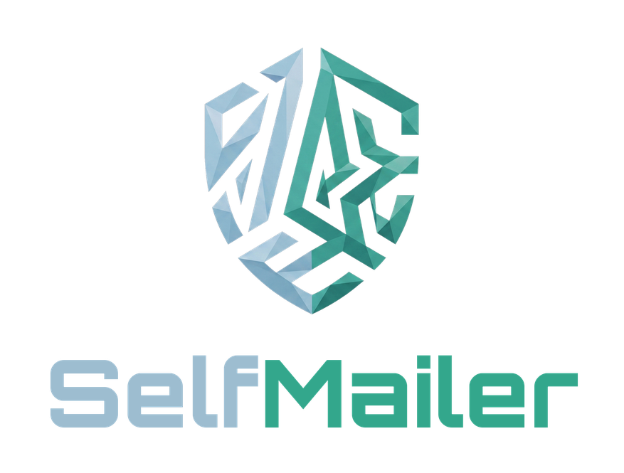

<div align="center">




**Self-hosted, multi-user e-mail client — with calendar, contacts, notes, a native Android app, and real-time sync. Your own alternative to Synology MailPlus.**

[](https://github.com/s3lfcod3r/selfmailer/actions/workflows/ci.yml)


[English](#-english) · [Deutsch](#-deutsch)

</div>

---

<a id="-english"></a>

## 🇬🇧 English

A single Docker container that is **not a mail server** — it's a **client** for the mailboxes you already have. It connects to any **IMAP / POP3** account to read and to **SMTP** to send, and adds a **calendar, contacts, notes and tasks** on top. A polished **web UI** and a **native Android app** share **one JSON API** — and stay in sync **live** across devices.

Part of the **Self** family (SelfAuthenticator, SelfArchiver, SelfDashboard …) — same design system, same deploy style (GHCR → Unraid).

> **TL;DR** — IMAP/SMTP mail client · calendar/contacts/notes · web + native Android · live cross-device sync · 3 notification options (FCM / ntfy / background) · 2FA · single container · no external DB.

### 📑 Table of contents
[Features](#-features) · [Architecture](#-architecture) · [Notifications](#-notifications) · [Live sync](#-live-sync) · [Quick start](#-quick-start-docker) · [Unraid](#-unraid) · [Configuration](#%EF%B8%8F-configuration-env-prefix-selfmailer_) · [Android app](#-android-app) · [API](#-api-overview-apiv1-jwt-bearer) · [Security](#%EF%B8%8F-security) · [Tech stack](#-tech-stack) · [Development](#%EF%B8%8F-development) · [Roadmap](#%EF%B8%8F-roadmap)

### ✨ Features

**📬 Mail**
- Multiple **IMAP / POP3 / SMTP** accounts per user
- **Thunderbird-style** stacked accounts with a per-account folder tree and **unread counters**
- Read **HTML mail** (hardened), download/open **attachments**, **SPF/DKIM/DMARC** spoofing check
- **Compose / reply / forward** with a per-account **From** picker and **signatures**; drafts, read/delivery receipts
- **Star**, mark read/unread, delete, **move**, **cross-account transfer**
- **Multi-select** (long-press → select → bulk move / read / unread / star / delete)
- **Filter rules** (move/star/mark/**delete** — applied automatically on every background sync) and **server-side mailbox migration**
- **Block sender** in one click → mail goes to **trash** (existing + future); a **blocked-senders list** lets you undo any block, and the trash auto-empties after 7 days (safe 7-day undo window)
- **Auto-empty spam & trash** per account (off / immediately / after 7 / 30 days)
- **Search** with quick filters (unread · has attachment · starred), pagination, snippets
- A local **SQLite cache** kept warm by a background sync → the UI never waits on a slow provider

**📅 Organizer**
- **Calendar** — local events, month/agenda views, birthdays from contacts
- **Contacts** — rich address book (phones, address, organisation, website, birthday)
- **Notes** & **Tasks**
- **CalDAV / CardDAV** pull from external servers (Nextcloud, Synology …) + subscribable **ICS / vCard** export feeds

**🔔 Notifications — you choose**
- **FCM (Google Push)** — instant, no persistent notification (like Gmail/Synology)
- **ntfy** — self-hosted push, no Google
- **Background check** — ~1 min, zero setup
- **Per account, per folder** — pick exactly which mailboxes notify you
- Configurable in **both** the web UI and the app — one shared setting

**🔄 Live sync (SSE)**
- Read/delete/move on your phone → an open web tab **updates instantly** (and vice-versa)

**🔐 Security & platform**
- **Multi-user** with admin/user roles; admin can pre-configure accounts for users
- **2FA / TOTP** login with backup codes; biometric **app-lock** on Android
- Account credentials **Fernet-encrypted at rest**
- **i18n DE/EN**, light/dark themes + custom accent colours
- **Single container** — FastAPI + SQLite, no external database

### 🧭 Architecture

```
        ┌──────────────┐          ┌───────────────┐
        │   Web UI     │          │  Android app  │
        │ React + Vite │          │ Kotlin/Compose│
        └──────┬───────┘          └──────┬────────┘
               └───── JSON API + SSE ─────┘
                   /api/v1 · JWT (Bearer)
                          │
                 ┌────────▼─────────┐
                 │   FastAPI core   │  SQLite (cache + config)
                 │  background sync │  Fernet-encrypted secrets
                 │  + event bus     │  in-memory pub/sub → live sync
                 └────────┬─────────┘
        ┌──────────┬──────┴───────┬──────────────┬───────────┐
   IMAP / POP3   SMTP      CalDAV / CardDAV     FCM         ntfy
  (read mail) (send mail) (sync cal & contacts) (Google push) (self-hosted push)
```

### 🔔 Notifications

Pick a method in **Settings → E-Mail notifications** (web *user menu → 🔔* / app *Settings*). The server can drive **all three** in parallel — e.g. FCM on your main phone, ntfy on a de-Googled one.

| Method | Latency | Persistent notification | Needs |
|---|---|---|---|
| **FCM (Google Push)** | instant | none | Firebase project + Google Play Services |
| **ntfy** | instant | none (the ntfy app holds one connection for all apps) | ntfy container + ntfy app |
| **Background check** | ~1 min | yes (Android requirement for a foreground service) | nothing |

**Per-folder:** under *Choose folders* you pick, per account, which folders trigger a push.

<details>
<summary><b>Setup — FCM (Google Push)</b></summary>

1. Create a free **Firebase** project at <https://console.firebase.google.com>.
2. **Add Android app** with package name `com.selfmailer.viewer` → download **`google-services.json`** (goes into the app build).
3. Project settings → **Service accounts** → **Generate new private key** → download the JSON.
4. Put that JSON on the server as `…/selfmailer/data/fcm-service-account.json` and set
   `SELFMAILER_FCM_CREDENTIALS=/data/fcm-service-account.json` → restart the container.
5. In the app: notifications on → **Google Push (FCM)** → pick folders → use **Send test push** to verify.

> The push payload is intentionally minimal ("2 new e-mails"); the app fetches the actual content from **your** server, so Google never sees mail bodies.
</details>

<details>
<summary><b>Setup — ntfy (self-hosted)</b></summary>

1. Run an **ntfy** container (e.g. `binwiederhier/ntfy serve`, host port `8095` → container `80`, `NTFY_BASE_URL=http://<host>:8095`).
2. Install the **ntfy app**, add your server, subscribe to the topic SelfMailer shows you.
3. In SelfMailer: notifications on → **ntfy** → enter the URL → **Save & enable** → pick folders.
</details>

### 🔄 Live sync

Every open client (web tab, app in the foreground) holds a thin **SSE** connection (`/api/v1/events/stream`). Whenever anyone performs an action — or new mail arrives — the server emits a tiny event and the other clients refresh the affected folder. No polling storm, no Google, near-instant.

### 🚀 Quick start (Docker)

```bash
cp .env.example .env
# generate a secret and put it in .env (SELFMAILER_SECRET):
python -c "import secrets; print(secrets.token_hex(32))"

docker compose up -d
```

Open `http://<host>:8090` → the **first-run setup** creates the admin account → then add your mail accounts.

### 📦 Unraid

Add the template from
`https://raw.githubusercontent.com/s3lfcod3r/selfmailer/main/unraid/selfmailer.xml`
or import it under *Docker → Add Container → Template*. Set the **Master Secret**, leave the rest on defaults.

> **Master Secret:** never change `SELFMAILER_SECRET` after first run — it encrypts the stored mailbox passwords. Changing it makes them unreadable.
>
> **Permissions:** the container runs **non-root** (uid `99` / gid `100` = `nobody:users`). If a data file is owned by root, fix it once:
> `chown -R 99:100 /mnt/user/appdata/selfmailer` (or *Tools → Docker Safe New Permissions*).

### ⚙️ Configuration (ENV, prefix `SELFMAILER_`)

| Variable | Required | Default | Purpose |
|---|---|---|---|
| `SELFMAILER_SECRET` | ✅ | – | JWT signing **and** at-rest encryption of mailbox passwords (≥ 32 chars). **Do not change after setup.** |
| `SELFMAILER_DB_PATH` | – | `/data/selfmailer.db` | SQLite path |
| `SELFMAILER_FCM_CREDENTIALS` | – | `/data/fcm-service-account.json` | Path to the Firebase service-account JSON for Google push. Empty/missing = FCM off. |
| `SELFMAILER_TRANSLATE_URL` | – | – | URL of a self-hosted LibreTranslate instance for in-app e-mail translation (e.g. `http://192.168.1.10:5000`). Empty = translation off (button hidden). |
| `SELFMAILER_TRANSLATE_API_KEY` | – | – | Optional API key, only if your LibreTranslate instance requires one. |
| `SELFMAILER_ADMIN_TOKEN` | – | – | If set, first-run admin setup requires this token |
| `SELFMAILER_BASE_URL` | – | – | Public base URL (e.g. for feed links) |
| `SELFMAILER_SYNC_INTERVAL` | – | `300` | Seconds between background mail syncs (lower = faster push & sync) |
| `SELFMAILER_DAV_SYNC_INTERVAL` | – | `120` | Seconds between calendar/contact (DAV) syncs — separate from mail, min 30 |
| `SELFMAILER_SYNC_DISABLE` | – | `0` | Turn off the background sync |
| `SELFMAILER_IMAP_TIMEOUT` | – | `15` | IMAP socket timeout (seconds) |
| `SELFMAILER_DAV_BLOCK_PRIVATE` | – | `false` | Block private/LAN targets for DAV pull (SSRF strict mode) |
| `SELFMAILER_JWT_ALGORITHM` | – | `HS256` | `HS256` / `HS384` / `HS512` |
| `SELFMAILER_BACKUP_ENABLED` | – | `true` | Nightly automatic DB backup (~03:00) |
| `SELFMAILER_BACKUP_KEEP` | – | `7` | How many backups to keep (older ones are rotated out; `0` = keep all) |

### 💾 Backups

The scheduler takes a **consistent** nightly snapshot of the SQLite database
(`sqlite3` online-backup API, safe during writes) into `data/backups/`:

```
data/backups/selfmailer-YYYYMMDD-HHMMSS.db
```

Only the last `SELFMAILER_BACKUP_KEEP` snapshots are kept. The folder is
git-ignored. To **restore** a backup, stop the container, replace the live DB
with a snapshot, then start again:

```bash
docker stop selfmailer
cp data/backups/selfmailer-20260101-030000.db data/selfmailer.db
# remove stale WAL/SHM sidecars so the restored file is authoritative
rm -f data/selfmailer.db-wal data/selfmailer.db-shm
docker start selfmailer
```

### 📱 Android app

A real native client (`android/SelfMailer.apk`) — **not** a web-view wrapper. Built like Synology MailPlus:

- **Hamburger drawer** → account switcher + special folders + sub-folders, with unread badges
- **Bottom navigation**: Mail · Calendar · Notes
- HTML mail, attachments, **multi-select** with a bulk action bar, **search filters**, Synology-style **compose** with From picker
- **Biometric app-lock** (face / fingerprint / device PIN), unread accent markers
- **Notifications**: FCM / ntfy / background — your choice, per folder
- Talks to the same `/api/v1` as the web UI; server URL entered on first launch

### 🔌 API overview (`/api/v1`, JWT Bearer)

| Group | Endpoints (excerpt) |
|---|---|
| **Auth** | `auth/status`, `auth/setup`, `auth/login`, `auth/login/totp`, `auth/me`, `auth/totp/*` |
| **Accounts** | `accounts` (CRUD), `accounts/{id}/test` |
| **Mail** | `mail/{id}/folders[/counts]`, `mail/{id}/messages`, `…/{uid}`, `…/flags`, `…/move`, `…/send`, `…/transfer`, `…/batch-*` |
| **Organizer** | `calendar/events`, `contacts`, `notes`, `tasks` |
| **DAV / Feeds** | `dav/accounts`, `feeds/token`, `calendar/export.ics`, `contacts/export.vcf` |
| **Push** | `push` (ntfy), `push/folders` (per-account folders), `push/device` (FCM tokens), `push/test` |
| **Live** | `events/stream` (Server-Sent Events) |
| **Dashboard** | `dashboard/summary` (bundled unseen counts) |

### 🛡️ Security

- Login passwords **Argon2**-hashed; mailbox & DAV passwords **Fernet-encrypted at rest** (key from `SELFMAILER_SECRET`)
- **JWT** pinned to `HS256/384/512`; the 2FA intermediate token grants no access
- **Rate limiting** on login/2FA/setup; defensive response headers; **anti-enumeration** dummy hash
- **SSRF guard** on DAV pull (loopback/link-local/cloud-metadata always blocked)
- Android: `allowBackup=false`, JWT in the **Android Keystore**, hardened mail-HTML WebView, FileProvider with path-traversal check
- **Deliberate LAN trade-offs** (documented): cleartext HTTP allowed (TLS terminated externally), `SELFMAILER_SECRET` doubles as the encryption seed. Reviewed with the ECC security reviewer.

### 🧱 Tech stack

| Part | Tech |
|---|---|
| Backend | FastAPI · SQLModel · SQLite (WAL) · httpx · aiosmtplib · imap-tools · PyJWT |
| Web | React · Vite · TypeScript · EventSource (SSE) |
| App | Kotlin · Jetpack Compose · OkHttp · WorkManager · Firebase Messaging · BiometricPrompt |
| Push | FCM (Google) · ntfy (self-hosted) |
| Deploy | Docker (multi-stage, non-root) · GHCR · Unraid |

### 🛠️ Development

```bash
# Backend
cd backend && pip install -r requirements.txt
export SELFMAILER_SECRET=$(python -c "import secrets; print(secrets.token_hex(32))")
uvicorn app.main:app --reload --port 8090

# Web (second terminal)
cd frontend && npm install && npm run dev   # http://localhost:5173, proxies /api → :8090
```

Interactive API docs: `http://localhost:8090/docs`

**Run the tests:** `cd backend && pip install -r requirements.txt -r requirements-dev.txt && pytest --cov=app`
(pytest + TestClient against a temp SQLite — currently ~48 % coverage; the IMAP/SMTP/DAV paths need mocking to push higher.)

### 🗺️ Roadmap

- [x] Mail (IMAP/POP3/SMTP) · stacked accounts · folder tree + unread counts
- [x] Calendar · Contacts · Notes · Tasks · CalDAV/CardDAV + ICS/vCard feeds
- [x] 2FA / TOTP · filter rules · cross-account transfer · multi-select · search filters
- [x] Native Android app (Synology-style, biometric lock)
- [x] Notifications: **FCM** + **ntfy** + background, per account & folder
- [x] **Live sync** (SSE) between web clients **and** the Android app (foreground)
- [x] Calendar month grid in the app
- [x] [HTTPS reverse-proxy guide](docs/HTTPS.md)
- [ ] OAuth for Gmail / Outlook
- [ ] Tests toward 80 % coverage

---

<a id="-deutsch"></a>

## 🇩🇪 Deutsch

Ein einzelner Docker-Container, der **kein Mailserver** ist — sondern ein **Client** für die Postfächer, die du schon hast. Er verbindet sich mit jedem **IMAP-/POP3**-Konto zum Lesen und mit **SMTP** zum Senden und bringt **Kalender, Kontakte, Notizen und Aufgaben** mit. Eine ausgefeilte **Web-Oberfläche** und eine **native Android-App** teilen sich **eine JSON-API** — und bleiben **live** über Geräte hinweg synchron.

Teil der **Self**-Reihe (SelfAuthenticator, SelfArchiver, SelfDashboard …) — gleiches Design-System, gleicher Deploy-Stil (GHCR → Unraid).

> **Kurz** — IMAP/SMTP-Mail-Client · Kalender/Kontakte/Notizen · Web + native Android · Live-Sync · 3 Benachrichtigungs-Wege (FCM / ntfy / Hintergrund) · 2FA · ein Container · keine externe DB.

### ✨ Funktionen

**📬 Mail**
- Mehrere **IMAP-/POP3-/SMTP**-Konten pro Nutzer
- **Thunderbird-Ansicht**: gestapelte Konten mit Ordnerbaum und **Ungelesen-Zählern**
- **HTML-Mails** lesen (gehärtet), **Anhänge** öffnen, **SPF/DKIM/DMARC**-Spoofing-Check
- **Schreiben / Antworten / Weiterleiten** mit **Von-Konto-Auswahl** und **Signaturen**; Entwürfe, Lese-/Empfangsbestätigung
- **Stern**, gelesen/ungelesen, löschen, **verschieben**, **Konto-übergreifend übertragen**
- **Mehrfachauswahl** (lange drücken → auswählen → Sammelaktionen Verschieben/Gelesen/Ungelesen/Stern/Löschen)
- **Filterregeln** (Verschieben/Stern/Gelesen/**Löschen** — werden bei jedem Hintergrund-Sync automatisch angewandt) und serverseitige **Postfach-Migration**
- **Absender blockieren** per Klick → Mails wandern in den **Papierkorb** (vorhandene + künftige); eine **Blacklist** zeigt alle Blockierungen und lässt sie wieder aufheben, der Papierkorb leert sich nach 7 Tagen (sicheres 7-Tage-Rückgängig-Fenster)
- **Spam & Papierkorb automatisch leeren** je Konto (aus / sofort / nach 7 / 30 Tagen)
- **Suche** mit Schnellfiltern (ungelesen · Anhang · Stern), Pagination, Vorschauen
- Lokaler **SQLite-Cache**, vom Hintergrund-Sync warmgehalten → die UI wartet nie auf einen langsamen Provider

**📅 Organizer**
- **Kalender** — lokale Termine, Monats-/Agenda-Ansicht, Geburtstage aus Kontakten
- **Kontakte** — reiches Adressbuch (Telefon, Adresse, Firma, Website, Geburtstag)
- **Notizen** & **Aufgaben**
- **CalDAV-/CardDAV**-Pull von externen Servern (Nextcloud, Synology …) + abonnierbare **ICS-/vCard**-Feeds

**🔔 Benachrichtigungen — du wählst**
- **FCM (Google-Push)** — sofort, keine Dauer-Benachrichtigung (wie Gmail/Synology)
- **ntfy** — self-hosted, kein Google
- **Hintergrund-Prüfung** — ~1 Min, null Setup
- **Pro Konto, pro Ordner** — wähle genau, welche Postfächer benachrichtigen
- Einstellbar in **Web-UI und App** — eine gemeinsame Einstellung

**🔄 Live-Sync (SSE)**
- Lesen/Löschen/Verschieben am Handy → ein offener Web-Tab **aktualisiert sich sofort** (und umgekehrt)

**🔐 Sicherheit & Plattform**
- **Multi-User** mit Admin-/Nutzer-Rollen; Admin kann Konten vorkonfigurieren
- **2FA / TOTP** mit Backup-Codes; biometrische **App-Sperre** unter Android
- Konto-Zugangsdaten **Fernet-verschlüsselt at-rest**
- **i18n DE/EN**, helles/dunkles Theme + eigene Akzentfarben
- **Ein Container** — FastAPI + SQLite, keine externe Datenbank

### 🔔 Benachrichtigungen

Methode in **Einstellungen → E-Mail-Benachrichtigungen** wählen (Web *Benutzer-Menü → 🔔* / App *Einstellungen*). Der Server bedient **alle drei** parallel — z. B. FCM aufs Haupt-Handy, ntfy auf ein entgoogeltes.

| Methode | Latenz | Dauer-Benachrichtigung | Voraussetzung |
|---|---|---|---|
| **FCM (Google-Push)** | sofort | keine | Firebase-Projekt + Google-Play-Dienste |
| **ntfy** | sofort | keine (die ntfy-App hält eine Verbindung für alle Apps) | ntfy-Container + ntfy-App |
| **Hintergrund-Prüfung** | ~1 Min | ja (Android-Pflicht für einen Vordergrund-Dienst) | nichts |

**Pro Ordner:** unter *Ordner auswählen* legst du je Konto fest, welche Ordner pushen.

<details>
<summary><b>Einrichtung — FCM (Google-Push)</b></summary>

1. Kostenloses **Firebase**-Projekt anlegen: <https://console.firebase.google.com>.
2. **Android-App** mit Paketname `com.selfmailer.viewer` hinzufügen → **`google-services.json`** laden (kommt in den App-Build).
3. Projekteinstellungen → **Dienstkonten** → **Neuen privaten Schlüssel generieren** → JSON laden.
4. Diese JSON auf den Server als `…/selfmailer/data/fcm-service-account.json` legen und
   `SELFMAILER_FCM_CREDENTIALS=/data/fcm-service-account.json` setzen → Container neu starten.
5. In der App: Benachrichtigungen an → **Google-Push (FCM)** → Ordner wählen → mit **Test-Push** prüfen.

> Der Push-Inhalt ist bewusst minimal („2 neue E-Mails"); die Details holt die App direkt von **deinem** Server — Google sieht keine Mail-Inhalte.
</details>

<details>
<summary><b>Einrichtung — ntfy (self-hosted)</b></summary>

1. **ntfy**-Container starten (z. B. `binwiederhier/ntfy serve`, Host-Port `8095` → Container `80`, `NTFY_BASE_URL=http://<host>:8095`).
2. **ntfy-App** installieren, Server eintragen, das in SelfMailer gezeigte Thema abonnieren.
3. In SelfMailer: Benachrichtigungen an → **ntfy** → URL eintragen → **Speichern & aktivieren** → Ordner wählen.
</details>

### 🔄 Live-Sync

Jeder offene Client (Web-Tab, App im Vordergrund) hält eine dünne **SSE**-Verbindung (`/api/v1/events/stream`). Macht irgendwer eine Aktion — oder trifft neue Mail ein — schickt der Server ein winziges Event und die anderen Clients frischen den betroffenen Ordner auf. Kein Polling-Sturm, kein Google, quasi sofort.

### 🚀 Schnellstart (Docker)

```bash
cp .env.example .env
# Secret erzeugen und in .env eintragen (SELFMAILER_SECRET):
python -c "import secrets; print(secrets.token_hex(32))"

docker compose up -d
```

`http://<host>:8090` öffnen → **Erst-Setup** legt den Admin an → danach Mailkonten hinzufügen.

### 📦 Unraid

Template über
`https://raw.githubusercontent.com/s3lfcod3r/selfmailer/main/unraid/selfmailer.xml`
hinzufügen oder unter *Docker → Add Container → Template* importieren. **Master Secret** setzen, Rest auf Standard.

> **Master Secret:** `SELFMAILER_SECRET` nach dem ersten Start **nie ändern** — er verschlüsselt die gespeicherten Postfach-Passwörter. Ändern macht sie unlesbar.
>
> **Rechte:** der Container läuft **non-root** (uid `99` / gid `100` = `nobody:users`). Gehört eine Datei root, einmal korrigieren:
> `chown -R 99:100 /mnt/user/appdata/selfmailer` (oder *Tools → Docker Safe New Permissions*).

### ⚙️ Konfiguration (ENV, Prefix `SELFMAILER_`)

| Variable | Pflicht | Default | Zweck |
|---|---|---|---|
| `SELFMAILER_SECRET` | ✅ | – | JWT-Signatur **und** At-Rest-Verschlüsselung der Postfach-Passwörter (≥ 32 Zeichen). **Nach Setup nicht ändern.** |
| `SELFMAILER_DB_PATH` | – | `/data/selfmailer.db` | SQLite-Pfad |
| `SELFMAILER_FCM_CREDENTIALS` | – | `/data/fcm-service-account.json` | Pfad zur Firebase-Service-Account-JSON für Google-Push. Leer/fehlend = FCM aus. |
| `SELFMAILER_TRANSLATE_URL` | – | – | URL einer self-hosted LibreTranslate-Instanz für die Mail-Übersetzung (z. B. `http://192.168.1.10:5000`). Leer = Übersetzung aus (Button versteckt). |
| `SELFMAILER_TRANSLATE_API_KEY` | – | – | Optionaler API-Key, nur falls deine LibreTranslate-Instanz einen verlangt. |
| `SELFMAILER_ADMIN_TOKEN` | – | – | Wenn gesetzt, verlangt das Erst-Setup diesen Token |
| `SELFMAILER_BASE_URL` | – | – | Öffentliche Basis-URL (z. B. für Feed-Links) |
| `SELFMAILER_SYNC_INTERVAL` | – | `300` | Sekunden zwischen Mail-Hintergrund-Syncs (kleiner = schnellerer Push & Sync) |
| `SELFMAILER_DAV_SYNC_INTERVAL` | – | `120` | Sekunden zwischen Kalender-/Kontakt-Syncs (DAV) — getrennt vom Mail-Sync, min. 30 |
| `SELFMAILER_SYNC_DISABLE` | – | `0` | Hintergrund-Sync abschalten |
| `SELFMAILER_IMAP_TIMEOUT` | – | `15` | IMAP-Socket-Timeout (Sekunden) |
| `SELFMAILER_DAV_BLOCK_PRIVATE` | – | `false` | Private/LAN-Ziele beim DAV-Pull blocken (SSRF-Strikt-Modus) |
| `SELFMAILER_JWT_ALGORITHM` | – | `HS256` | `HS256` / `HS384` / `HS512` |
| `SELFMAILER_BACKUP_ENABLED` | – | `true` | Nächtliches automatisches DB-Backup (~03:00) |
| `SELFMAILER_BACKUP_KEEP` | – | `7` | Anzahl behaltener Backups (ältere werden rotiert; `0` = alle behalten) |

### 💾 Backups

Der Scheduler zieht nachts (~03:00) ein **konsistentes** Backup der SQLite-DB
(via `sqlite3`-Online-Backup-API, sicher auch bei laufenden Schreibvorgängen)
nach `data/backups/`:

```
data/backups/selfmailer-YYYYMMDD-HHMMSS.db
```

Es werden nur die letzten `SELFMAILER_BACKUP_KEEP` Snapshots behalten. Der
Ordner ist git-ignoriert. **Wiederherstellen:** Container stoppen, die Live-DB
durch ein Backup ersetzen, neu starten:

```bash
docker stop selfmailer
cp data/backups/selfmailer-20260101-030000.db data/selfmailer.db
# veraltete WAL/SHM-Dateien entfernen, damit die wiederhergestellte Datei gilt
rm -f data/selfmailer.db-wal data/selfmailer.db-shm
docker start selfmailer
```

### 📱 Android-App

Ein echter nativer Client (`android/SelfMailer.apk`) — **kein** WebView-Wrapper. Gebaut wie Synology MailPlus:

- **Hamburger-Schublade** → Konto-Wechsler + Sonderordner + Unterordner, mit Ungelesen-Badges
- **Untere Navigation**: Mail · Kalender · Notizen
- HTML-Mail, Anhänge, **Mehrfachauswahl** mit Aktionsleiste, **Such-Filter**, Synology-Stil-**Schreiben** mit Von-Auswahl
- **Biometrie-App-Sperre** (Gesicht / Finger / Geräte-PIN), Akzent-Markierung für Ungelesene
- **Benachrichtigungen**: FCM / ntfy / Hintergrund — deine Wahl, pro Ordner
- Spricht dieselbe `/api/v1` wie die Web-UI; Server-URL beim ersten Start

### 🔌 API-Überblick (`/api/v1`, JWT Bearer)

| Bereich | Endpunkte (Auszug) |
|---|---|
| **Auth** | `auth/status`, `auth/setup`, `auth/login`, `auth/login/totp`, `auth/me`, `auth/totp/*` |
| **Konten** | `accounts` (CRUD), `accounts/{id}/test` |
| **Mail** | `mail/{id}/folders[/counts]`, `mail/{id}/messages`, `…/{uid}`, `…/flags`, `…/move`, `…/send`, `…/transfer`, `…/batch-*` |
| **Organizer** | `calendar/events`, `contacts`, `notes`, `tasks` |
| **DAV / Feeds** | `dav/accounts`, `feeds/token`, `calendar/export.ics`, `contacts/export.vcf` |
| **Push** | `push` (ntfy), `push/folders` (Ordner je Konto), `push/device` (FCM-Tokens), `push/test` |
| **Live** | `events/stream` (Server-Sent Events) |
| **Dashboard** | `dashboard/summary` (gebündelte Ungelesen-Zähler) |

### 🛡️ Sicherheit

- Login-Passwörter **Argon2**-gehasht; Postfach- & DAV-Passwörter **Fernet-verschlüsselt at-rest** (Key aus `SELFMAILER_SECRET`)
- **JWT** auf `HS256/384/512` festgenagelt; der 2FA-Zwischen-Token gewährt keinen Zugriff
- **Rate-Limiting** auf Login/2FA/Setup; defensive Response-Header; **Anti-Enumeration**-Dummy-Hash
- **SSRF-Schutz** beim DAV-Pull (loopback/link-local/Cloud-Metadata immer geblockt)
- Android: `allowBackup=false`, JWT im **Android-Keystore**, gehärteter Mail-HTML-WebView, FileProvider mit Path-Traversal-Check
- **Bewusste LAN-Trade-offs** (dokumentiert): Klartext-HTTP erlaubt (TLS extern terminiert), `SELFMAILER_SECRET` ist zugleich der Verschlüsselungs-Seed. Geprüft mit dem ECC-Security-Reviewer.

### 🧱 Technik-Stack

| Teil | Technik |
|---|---|
| Backend | FastAPI · SQLModel · SQLite (WAL) · httpx · aiosmtplib · imap-tools · PyJWT |
| Web | React · Vite · TypeScript · EventSource (SSE) |
| App | Kotlin · Jetpack Compose · OkHttp · WorkManager · Firebase Messaging · BiometricPrompt |
| Push | FCM (Google) · ntfy (self-hosted) |
| Deploy | Docker (Multi-Stage, non-root) · GHCR · Unraid |

### 🛠️ Entwicklung

```bash
# Backend
cd backend && pip install -r requirements.txt
export SELFMAILER_SECRET=$(python -c "import secrets; print(secrets.token_hex(32))")
uvicorn app.main:app --reload --port 8090

# Web (zweites Terminal)
cd frontend && npm install && npm run dev   # http://localhost:5173, proxyt /api → :8090
```

Interaktive API-Doku: `http://localhost:8090/docs`

**Tests ausführen:** `cd backend && pip install -r requirements.txt -r requirements-dev.txt && pytest --cov=app`
(pytest + TestClient gegen eine Temp-SQLite — aktuell ~48 % Coverage; die IMAP/SMTP/DAV-Pfade brauchen Mocking, um höher zu kommen.)

### 🗺️ Roadmap

- [x] Mail (IMAP/POP3/SMTP) · gestapelte Konten · Ordnerbaum + Ungelesen-Zähler
- [x] Kalender · Kontakte · Notizen · Aufgaben · CalDAV/CardDAV + ICS/vCard-Feeds
- [x] 2FA / TOTP · Filterregeln · Konto-übergreifend übertragen · Mehrfachauswahl · Such-Filter
- [x] Native Android-App (Synology-Stil, Biometrie-Sperre)
- [x] Benachrichtigungen: **FCM** + **ntfy** + Hintergrund, pro Konto & Ordner
- [x] **Live-Sync** (SSE) zwischen Web-Clients **und** der Android-App (Vordergrund)
- [x] Kalender-Monatsgitter in der App
- [x] [HTTPS-Reverse-Proxy-Anleitung](docs/HTTPS.md)
- [ ] OAuth für Gmail / Outlook
- [ ] Tests Richtung 80 % Coverage

---

<div align="center">

**SelfMailer** · part of the Self family · made with 📬 for self-hosting

</div>
